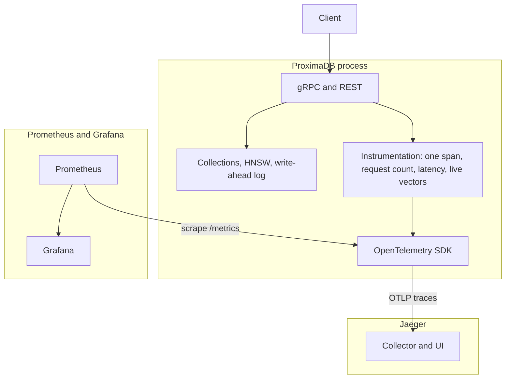

# ProximaDB

A vector database in Go. Each collection keeps an in-memory HNSW index. Inserts, searches, and deletes are appended to a write-ahead log and replayed on startup.

## Architecture

A client calls gRPC or REST. Both paths enter the same four methods: create a collection, insert a vector, search, or delete. A collection has a fixed dimension, a distance (cosine, L2, or dot; smaller is closer), an HNSW index, and equality tags stored beside the graph. Search walks HNSW, then keeps hits that match every tag. The exact flat index exists to grade that walk. A delete is a tombstone: the id disappears from results and stays in the graph for navigation.

Each change is appended to the write-ahead log first, then applied in memory. Opening the same data directory replays the log and rebuilds the graph. The log is `data/wal.log`.

Every one of those four calls is instrumented. The OpenTelemetry SDK inside the process exports traces and serves metrics. There is no OpenTelemetry Collector. Traces are pushed to Jaeger. Prometheus pulls `/metrics`, and Grafana reads Prometheus.



## Run

Defaults are gRPC on `127.0.0.1:7878` and REST on `127.0.0.1:7879`. `-listen` and `-http` change them. `-data` is required.

```bash
go run ./cmd/proximadb -listen 127.0.0.1:7878 -http 127.0.0.1:7879 -data ./data
```

Restarting with the same `-data` directory restores the collections.

JSON encodes ids as strings. gRPC serves the same four calls.

```bash
curl -sS -X POST http://127.0.0.1:7879/v1/collections \
  -H 'content-type: application/json' \
  -d '{"name":"images","dimension":2,"metric":"METRIC_L2"}'

curl -sS -X POST http://127.0.0.1:7879/v1/collections/images/vectors \
  -H 'content-type: application/json' \
  -d '{"id":"7","vector":[1,0],"tags":{"color":"red"}}'

curl -sS -X POST http://127.0.0.1:7879/v1/collections/images/search \
  -H 'content-type: application/json' \
  -d '{"vector":[1,0],"k":1,"filter":{"color":"red"}}'

curl -sS -X DELETE http://127.0.0.1:7879/v1/collections/images/vectors/7
```

### Dashboards

Compose starts Prometheus, Grafana, and Jaeger. It does not start ProximaDB.

```bash
cd deploy
docker compose up -d
```

Bind REST on all interfaces so Prometheus, running in Docker, can scrape the process. Start Jaeger first so the trace exporter has somewhere to send.

```bash
go run ./cmd/proximadb -listen 127.0.0.1:7878 -http 0.0.0.0:7879 -data ./data
```

| | |
| --- | --- |
| Metrics | http://127.0.0.1:7879/metrics |
| Prometheus | http://127.0.0.1:9091 |
| Grafana | http://127.0.0.1:3001 (`admin` / `admin`), dashboard **ProximaDB** |
| Jaeger | http://127.0.0.1:16686, service `proximadb` |

Grafana shows request count, request rate, latency, and how many vectors are still searchable. Jaeger shows one span per call. Ports `9091` and `3001` are the host mappings in this Compose file, because `9090` and `3000` are often already taken.

## Tests

```bash
go test ./...
```
